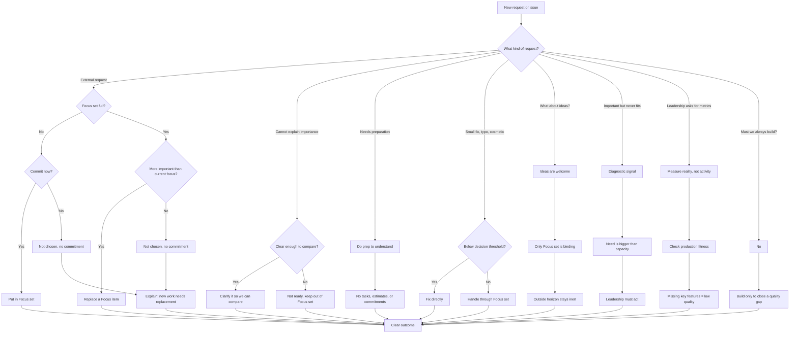

# Summary (One Page)

The 1..n Method is a way to decide what to build, what not to build, and how to judge progress.

Its core idea is simple: **replace, don't accumulate**. Teams work on a small active set, and new work enters only by displacing current work.

## Core Principles

1. Development always has friction. You can reduce it, not remove it.
2. Time and attention are limited and must be protected.
3. Every extra active item increases friction.
4. Prioritization is only reliable in the near term.
5. **1..n** is the small set we commit to now; one item is most important.
6. Beyond 1..n is a **cognitive horizon**: visible, but not committed.
7. Only 1..n is **operationally binding**.
8. Outside the cognitive horizon, work should be **inert**.
9. Leadership must choose and say no.

## Decision Flow

## Key Terms

- **1..n / Focus set:** The small active set (usually 1-3 items).
- **Inert:** Work that exists but is not active, prioritized, or promised.
- **Replacement:** New work enters only by displacing current focus.
- **Fitness for purpose:** Success in production for real users.

Version: **1.1.0**
