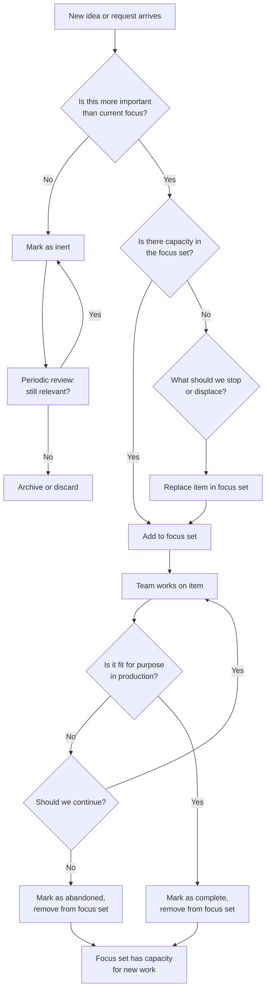

# Decision Flow

This document describes how work moves through the 1..n Method system, from initial idea to completion or abandonment.

## The Flow

## How to Read This Diagram

### Entry Point: New Idea Arrives

Every new request—feature idea, bug report, customer demand, internal initiative—enters at the same point: **"Is this more important than what we're doing right now?"**

### Decision 1: Priority Relative to Current Focus

If the answer is **No**, the item becomes **inert**. It may be recorded, discussed, or documented, but it is not active work.

If the answer is **Yes**, proceed to capacity evaluation.

### Decision 2: Capacity Check

If the focus set has room (e.g., the team is working on 1 item and the limit is 3), the new item can be added directly.

If the focus set is full, something must be **displaced** to make room.

### Decision 3: Replacement

Displacement requires answering: **"What are we willing to stop or pause?"**

This is the forcing function of the method. It requires real prioritization with real trade-offs.

Once an item is removed, the new item takes its place.

### Execution: Work Until Fit for Purpose

The team works on the item until it is **fit for purpose in production**—meaning it solves the problem for real users in a real environment.

If progress stalls, or if the value is no longer clear, the team decides: **Continue or abandon?**

Abandonment is not failure. It's a recognition that the work is not worth the cost, and the focus set slot should be freed for something better.

### Completion

When work is complete, it leaves the focus set, creating capacity for the next item.

### Inert Work: Periodic Review

Inert items are reviewed periodically (e.g., quarterly). If they're still relevant, they remain inert. If not, they're archived or discarded.

---

## Key Characteristics of This Flow

1. **No automatic queue.** There is no "next up" list. Each new item is evaluated against current reality.
2. **Explicit trade-offs.** Adding new work requires deciding what to stop.
3. **Reality-based completion.** Work is done when it's fit for purpose in production, not when it passes internal gates.
4. **Abandonment is normal.** Not all work should finish. Recognizing this early saves time.

This flow is simple, but it requires discipline and leadership support to execute consistently.
