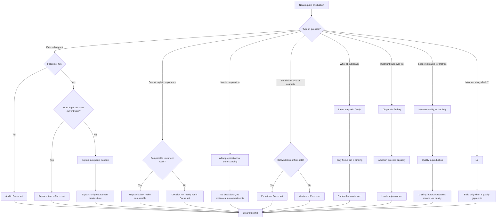

# Decision Flow

This document describes how the 1..n Method handles different types of requests, questions, and situations that arise in product development.

## The Flow

## How to Read This Diagram

The 1..n Method handles different types of situations differently. This flowchart shows the decision paths for common scenarios.

### Entry Point: New Request or Situation

Every situation enters at a classification point: **"What type of question is this?"**

The method handles different types of requests, questions, and situations using different decision paths.

---

## Decision Paths

### Path 1: External Request (Feature, Bug, Customer Demand)

When someone requests work to be done:

**If the focus set is not full:**
- Add the item directly to the focus set

**If the focus set is full:**
- Evaluate: Is this more important than current work?
  - **Yes:** Replace an item in the focus set
  - **No:** Say no. Explain there is no queue and no date. Only replacement creates time.

**Key principle:** No backlog queue. Work either enters now (by replacement if needed) or it doesn't happen. No false promises.

---

### Path 2: Cannot Explain Importance

When someone requests work but cannot articulate why it's important:

**If the request is comparable to current work:**
- Help the requester articulate importance
- Make it comparable so a real decision can be made

**If it's not comparable:**
- The decision is not ready
- Do not add to focus set
- Wait for clarity before committing

**Key principle:** Vague requests don't get committed. Clarity precedes commitment.

---

### Path 3: Needs Preparation

When work requires research, discovery, or technical investigation before it can be understood:

- Allow preparation time for understanding
- Do **not** break it down into tasks
- Do **not** estimate timelines
- Do **not** make commitments

**Key principle:** Preparation is legitimate, but it doesn't create obligations. Investigation comes before decision.

---

### Path 4: Small Fix, Typo, or Cosmetic Change

When something is trivial (typo, small visual fix, obvious correction):

**If below the decision threshold:**
- Fix it without focus set entry
- No formal process needed

**If not trivial:**
- Must enter focus set like any other work

**Key principle:** Don't bureaucratize the trivial. But be honest about what's actually trivial.

---

### Path 5: What About Ideas?

When someone asks, "Can we discuss ideas freely?"

**Answer:**
- Ideas may exist freely
- Only the focus set is binding
- Everything outside the cognitive horizon is inert

**Key principle:** Thinking and discussing are free. Commitment is not. Don't confuse conversation with obligation.

---

### Path 6: Important But Never Fits

When work is perpetually considered important but never enters the focus set:

**This is a diagnostic finding:**
- Ambition exceeds capacity
- The organization's goals are not aligned with its constraints
- **Leadership must act:** either increase capacity, reduce scope, or acknowledge the mismatch

**Key principle:** If something is always "next" but never starts, that's a structural problem, not a prioritization problem.

---

### Path 7: Leadership Asks for Metrics

When leadership asks, "How do we measure progress?"

**Answer:**
- Measure reality, not activity
- Focus on **quality in production**
- Recognize that **missing important features means low quality**

**Key principle:** Velocity, story points, and tickets closed are vanity metrics. Reality is whether the product solves problems.

---

### Path 8: Must We Always Build?

When someone asks, "Is the answer always to build more features?"

**Answer:**
- **No.**
- Build only when a quality gap exists
- Quality includes having the right features, not just bug-free code

**Key principle:** Sometimes the right answer is "the product is good enough." Building for its own sake is waste.

---

## Key Characteristics of This Flow

1. **Context-aware responses.** Different situations receive different treatments based on their nature.
2. **No false promises.** If something can't enter the focus set, say so clearly.
3. **Replacement is explicit.** When work must displace other work, that trade-off is visible.
4. **Diagnostic clarity.** Patterns (e.g., "always important, never done") surface structural problems.
5. **Reality over theater.** Metrics measure production outcomes, not internal activity.

---

## Common Scenarios

### Scenario: "Can you give me a date for Feature X?"

**Flow path:** External request → Focus set full → Not more important than current work → Say no, no queue, no date → Explain only replacement creates time

**Response:** "Feature X isn't in our focus set, and we're not displacing current work for it. There's no queue and no timeline. If it becomes critical, we can discuss what to stop."

---

### Scenario: "I have an idea I want to explore."

**Flow path:** What about ideas? → Ideas may exist freely → Only Focus set is binding → Outside horizon is inert

**Response:** "Absolutely, let's discuss it. Ideas are always welcome. Just know that exploring it doesn't commit us to building it unless it enters the focus set."

---

### Scenario: "We keep saying Platform Improvement is important, but we never do it."

**Flow path:** Important but never fits → Diagnostic finding → Ambition exceeds capacity → Leadership must act

**Response:** "That's a signal. If it's truly important but never fits, we have a capacity problem. Leadership needs to either make room (by stopping something else) or acknowledge that it's not actually critical."

---

### Scenario: "How do I know the team is making progress?"

**Flow path:** Leadership asks for metrics → Measure reality, not activity → Quality in production → Missing important features means low quality

**Response:** "Look at production. Are customer problems being solved? Is the product more fit for purpose? Don't measure velocity—measure reality."

---

This flow provides a structured way to handle the complexity of product development decision-making while maintaining the core principles of bounded focus, honest communication, and reality-based progress measurement.
